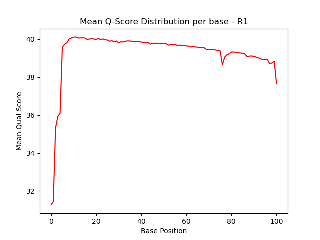
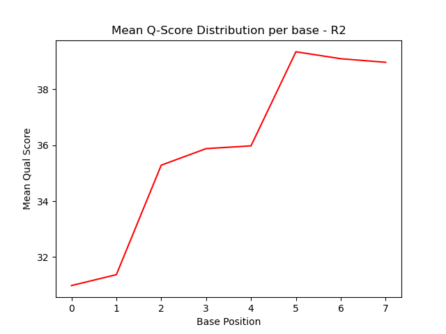
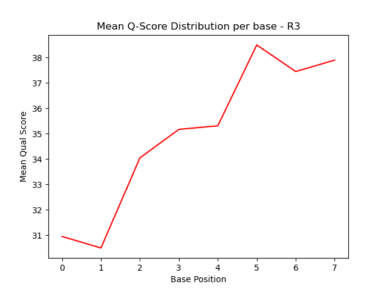
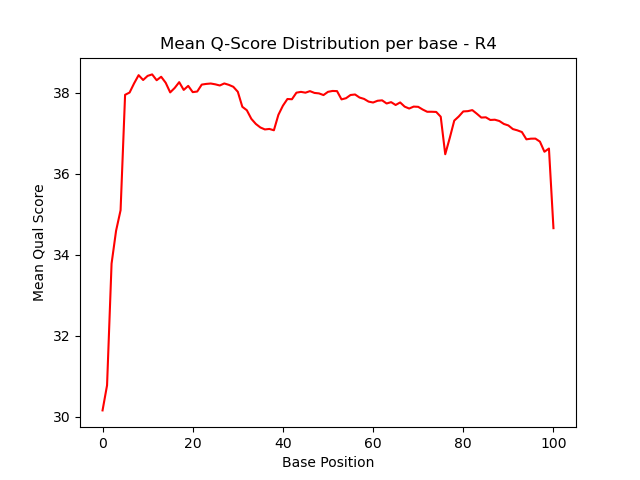

# Assignment the First

## Part 1
1. Be sure to upload your Python script. Provide a link to it here:
[generate mean qual score per base tsv](../avg_qscore_tsv.py)
[plot mean qual score distribution](../plt_qscore_distribution.py)

| File name | label | Read length | Phred encoding |
|---|---|---|---|
| 1294_S1_L008_R1_001.fastq.gz | biological read 1 | 101 | Phred+33 |
| 1294_S1_L008_R2_001.fastq.gz | index | 9 | Phred+33 |
| 1294_S1_L008_R3_001.fastq.gz | index | 9 | Phred+33 |
| 1294_S1_L008_R4_001.fastq.gz | biological read 2|  101| Phred+33 |

2. Per-base NT distribution
    1. Use markdown to insert your 4 histograms here.
    
    
    
    
    2. What is a good quality score cutoff for index reads and biological read pairs to utilize for sample identification and downstream analysis, respectively?
    These are RNA-seq samples where the biological reads will be used to map the transcriptome against a referece genome. For the purpose of demultiplexing, applying a quality score cutoff for the biological reads isn't necessary - downstream alignment processes will throw away low-quality biological reads. For the indeces however, we need to be more stringent to have high confidence that the barcodes are the correct sequence so that reads from the same sample can be bucketed in the same fastq file. There's a balance that needs to be struck though because if we go too stringent, we lose too many reads. To this end, I would use a mean quality score cuttoff of 30 - which has an accuracy of 99.9% (or a 1 in 1000 chance of a base call being wrong). Looking at the R2 and R3 distributions, the average score of the first and second bases of the index hover around 30 so setting this as the cutoff should leave behind the egregiously low reads that are bringing the average down.
    3. How many indexes have undetermined (N) base calls?
        R2 (Index 1)- 3976613
        R3 (Index 2) - 3328051
        total - 7304664
        ```zcat 1294_S1_L008_R2_001.fastq.gz |sed -n '2~4p'|grep  N | wc -l```

        ```zcat 1294_S1_L008_R3_001.fastq.gz |sed -n '2~4p'|grep  N | wc -l```
    
## Part 2
1. Define the problem
We have a sequencing output of 1+ billion reads --> need to bucket them by sample barcode/index. Tricky thing to remember - indexes can have "N"s and therefore low quality or they can be hopped
2. Describe output
52 FastQ files. 48 are for dual mapped reads (24 forward biological --> index_R1.fastq ; 24 reverse biological --> index_R2.fastq); 2 files for barcodes containing N's or ones that't don't meet qual score cuttoff (unknown_read1.fastq and unknown_read2.fastq); 2 files for bacodes that hopped (hopped_read1.fastq and hopped_read2.fastq)
3. Upload your [4 input FASTQ files](../TEST-input_FASTQ) and your [>=6 expected output FASTQ files](../TEST-output_FASTQ).
4. [Pseudocode](../demux_pseudocode.md)
5. High level functions. For each function, be sure to include:
    1. Description/doc string
    2. Function headers (name and parameters)
    3. Test examples for individual functions
    4. Return statement
    See [Pseudocode](../demux_pseudocode.md)
